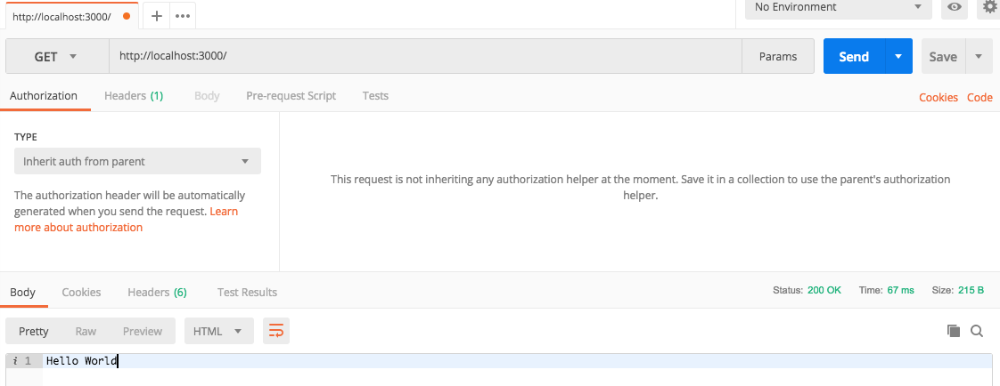
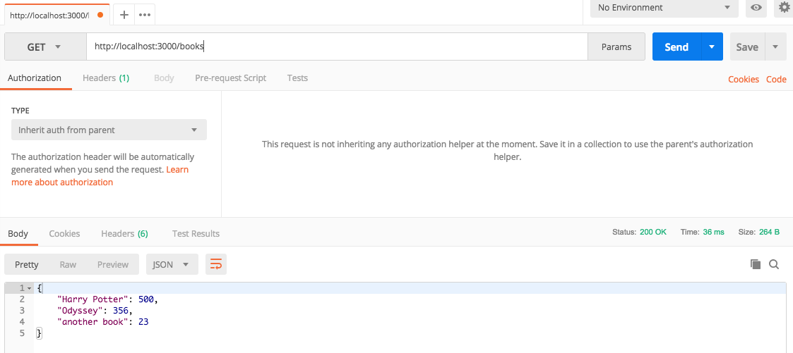

# Workshop

## Getting started
Make sure you have node and git installed in your local machine. If you have not done so, please go to the master branch of this repo and follow the instructions.

## Developing from Scratch
**This sections is basically when you start coding from scratch**
To start, make sure you are in a directory only meant for this project. Then, run the following command
`npm init`
This command will get you stared with the development. Just click enter until it stops for promps. You will see that a `package.json` file was created on your directory. That file contains all the dependencies necessary to run this program.

Now, lets install the basic libraries we will be using. Run the following command:
`npm install dotenv express --save`
The command above installs the express library we will be using to develop the API. Those are the only two dependencies needed to start building a simple API. 

Once it is installed, you will see that a `package-lock.json` file was created. 

Once completed, you are ready to go to your favorite text editor and start coding.

## Start the API
Run the following command: `node app`.

## Testing the API
There are two ways to test it. One is using your favorite web browser. The other is using Postman. To install Postman, refer to the README file on the master branch. I'll only show how to use Postman here. 

Open Postman, and create a new workspace.
Because we only created `GET` methods, select GET on Postman and then selected the URL to be `http://localhost:3000/`. Click send, and you should see as a response the `Hello World` text. Should look like this:

Cool right?

Now if we test the books endpoint, and call it by using the URL on Postman: `http://localhost:3000/books`, you should get the following:

And that is all we covered today. More to come!

## Where not at the Workshop?
If you were not at the workshop, and still want to know the mechanics, read above! 

## Fast Start and Play with API
Clone this repo to your local machine.
Run the command `npm install`. This will install the libraries we used for this basic API.
Run the command `node app`. You should get the following message on the terminal: `Listening in port 3000`